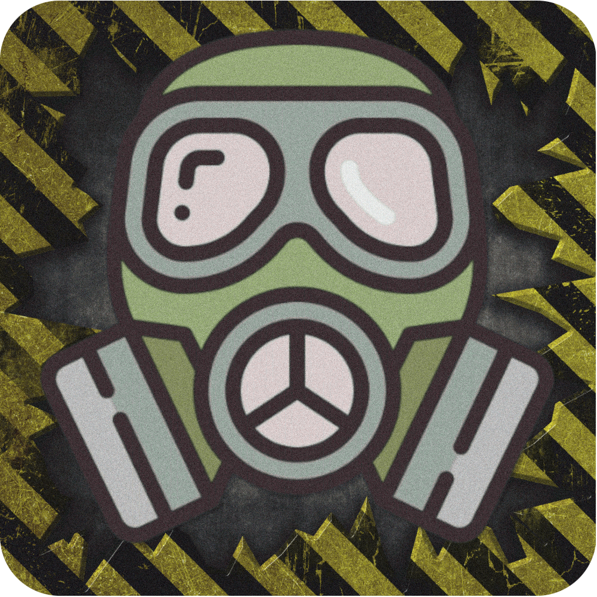

# Urbanaut-Frontend-Telegram

  

---

Social network for urban explorers - stalkers, diggers and so on.

## Stack

## Design

You can see the design
[here.](https://www.figma.com/design/6EmzkuTNKkvaDSr87iKKta/Urbanaut-Telegram-Web-V2?t=tXsEHtMTh0SD0HRG-1)

## Status

**V0.0.1 - Active Development 🟢**

## License

This software is developed under the Urbanaut License. See the bundled [LICENSE](LICENSE) file for details.